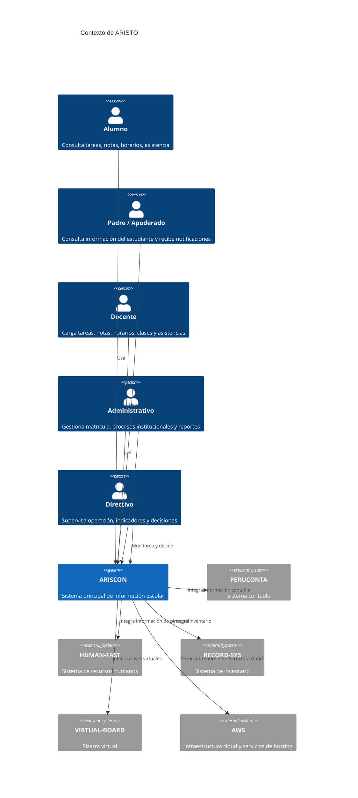

# Diagrama C4 de ARISCON / ARISTO

## 1. Contexto del negocio (C1)

ARISTO es una red de colegios privados en Perú, con una operación académica y administrativa que involucra a múltiples actores: directivos, docentes, administradores, padres/apoderados, alumnos y la gerencia de sistemas. El sistema de información principal es ARISCON, una plataforma digital que soporta la comunicación, notas, asistencia, matrícula, tareas, agenda, reportes y seguridad institucional.

El sistema no vive aislado: se integra con herramientas de contabilidad, RR. HH., inventario y pizarras virtuales, además de tener dependencia de infraestructura AWS y servicios SaaS de terceros.



## 2. Diagrama de contenedores (C2)

La solución actual está fragmentada en cinco aplicaciones distintas: Web, iOS, Android, Web Administrativa y Web Reporting. Todas se desarrollaron en diferentes momentos con distintos proveedores, tecnologías y estándares. Además, cada una tiene su propia seguridad y, en muchos casos, su propia base de datos, lo que genera inconsistencias transaccionales y desalineación funcional.

```mermaid
C4Container
    title Contenedores de ARISCON (arquitectura actual)

    Person(alumno, "Alumno")
    Person(padre, "Padre / Apoderado")
    Person(docente, "Docente")
    Person(admin, "Administrativo")
    Person(directivo, "Directivo")

    Container_Boundary(ariscon, "ARISCON") {
        Container(web, "ARISCON Web", "ASP.NET / IIS / .NET 4.6", "Portal principal del estudiante, padres y docentes")
        Container(mobile_iOS, "ARISCON iOS", "Swift", "Aplicación móvil para usuarios")
        Container(mobile_android, "ARISCON Android", "Android / Java/Kotlin", "Aplicación móvil para usuarios")
        Container(adminweb, "Web Administrativa", "ASP.NET / IIS", "Configuración, seguridad y administración interna")
        Container(reporting, "Web Reporting", "Reportes", "Consulta de reportes y dashboards")

        Container(api, "API REST / JSON", ".NET 4.6 / C#", "Servicios de negocio para los distintos clientes")
        ContainerDb(db_web, "Base de datos ARISCON Web", "SQL Server", "Datos de aplicación web")
        ContainerDb(db_mobile, "Base de datos móvil", "SQL Server / Access", "Datos de apps móviles")
        ContainerDb(db_admin, "Base de datos administrativa", "SQL Server", "Configuración, seguridad y administración")
        ContainerDb(db_report, "Base de datos reporting", "SQL Server", "Reportes y data de análisis")

        Container(auth, "Seguridad por aplicación", "Autenticación ad hoc", "Usuarios, claves y permisos separados por app")
        Container(logging, "Auditoría y logs", "Registros locales", "Operaciones, accesos, eventos")
    }

    System_Ext(aws, "AWS", "Infraestructura cloud")
    System_Ext(conta, "PERUCONTA", "Contabilidad")
    System_Ext(hr, "HUMAN-FAST", "RR. HH.")
    System_Ext(inventario, "RECORD-SYS", "Inventario")
    System_Ext(board, "VIRTUAL-BOARD", "Pizarras virtuales")

    Rel(alumno, web, "Consulta notas, tareas y asistencia")
    Rel(padre, web, "Consulta información del hijo")
    Rel(docente, web, "Carga notas y tareas")
    Rel(admin, adminweb, "Administración interna")
    Rel(directivo, reporting, "Consulta reportes")

    Rel(alumno, mobile_iOS, "Consulta desde móvil")
    Rel(padre, mobile_android, "Consulta desde móvil")
    Rel(docente, mobile_iOS, "Accede a servicios")

    Rel(web, api, "Consume servicios REST")
    Rel(adminweb, api, "Consume servicios REST")
    Rel(reporting, api, "Genera reportes")
    Rel(mobile_iOS, api, "Consume APIs")
    Rel(mobile_android, api, "Consume APIs")

    Rel(api, db_web, "Lee y escribe transacciones")
    Rel(api, db_mobile, "Sincroniza datos")
    Rel(api, db_admin, "Lee y escribe configuraciones")
    Rel(api, db_report, "Genera reportes")

    Rel(web, auth, "Autenticación por app")
    Rel(mobile_iOS, auth, "Autenticación por app")
    Rel(mobile_android, auth, "Autenticación por app")
    Rel(adminweb, auth, "Autenticación por app")
    Rel(reporting, auth, "Autenticación por app")

    Rel(api, logging, "Registra operaciones y auditoría")
    Rel(ariscon, conta, "Integración")
    Rel(ariscon, hr, "Integración")
    Rel(ariscon, inventario, "Integración")
    Rel(ariscon, board, "Integración")
    Rel(ariscon, aws, "Se ejecuta sobre AWS")
```

## 3. Conclusión del diagrama

El problema principal no es solo la tecnología, sino la arquitectura de solución fragmentada. Se observa:

- Cinco apps distintas para una misma necesidad.
- Cinco mecanismos de seguridad y autenticación.
- Bases de datos separadas y asincronías entre sistemas.
- Inconsistencia funcional entre web y móviles.
- Código complejo con alto technical debt.
- Falta de un modelo de arquitectura unificado y de estándares de calidad.

Esto explica la caída de servicio, la lentitud en la carga de notas, la exposición de contenido pornográfico y la dificultad para escalar a 30,000 usuarios concurrentes.
